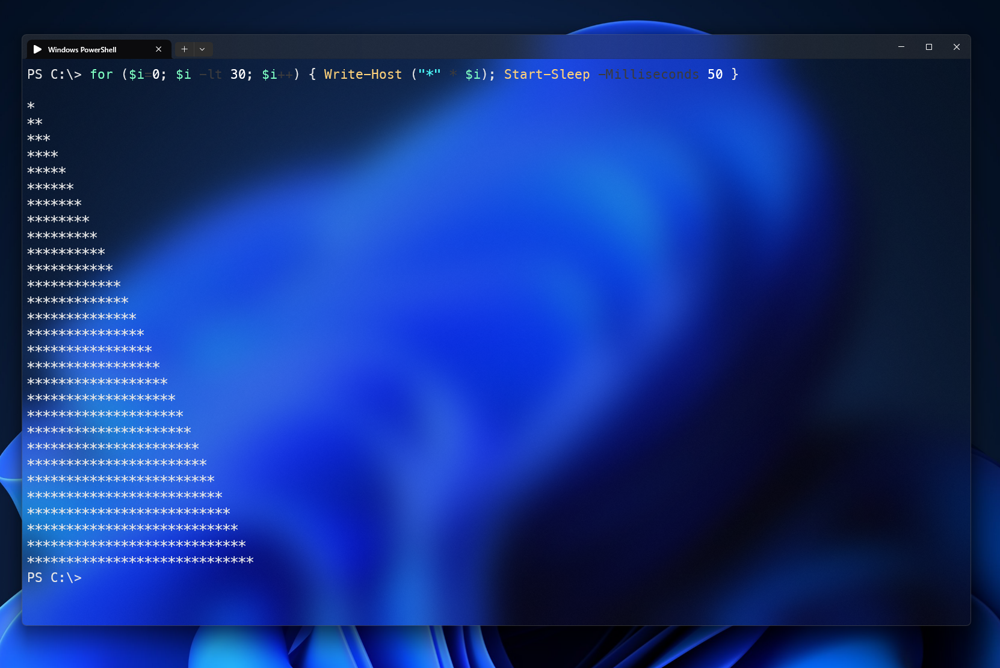
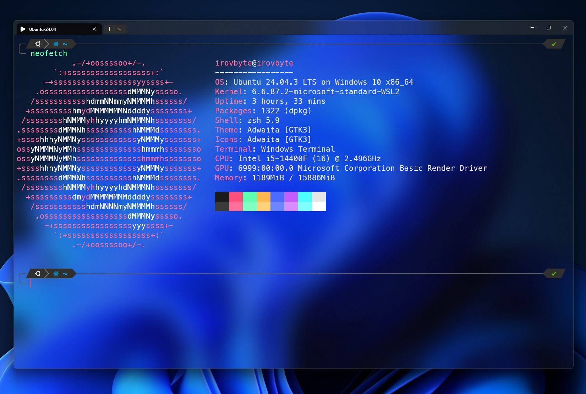

# 📚 Навигация

## 🪟 Windows
- [Установка Windows Terminal](#windows-terminal--установка-и-настройка)

---

## 🐧 Linux / WSL
- [Автоматическая установка Zsh + Oh My Zsh + Powerlevel10k](#полная-автоматическая-установка-zsh--oh-my-zsh--powerlevel10k--конфигов)
- [Ubuntu](#полная-автоматическая-установка-zsh--oh-my-zsh--powerlevel10k--конфигов)
- [Arch / Manjaro](#полная-автоматическая-установка-zsh--oh-my-zsh--powerlevel10k--конфигов)
- [Fedora](#полная-автоматическая-установка-zsh--oh-my-zsh--powerlevel10k--конфигов)
- [openSUSE](#полная-автоматическая-установка-zsh--oh-my-zsh--powerlevel10k--конфигов)
- [Alpine](#полная-автоматическая-установка-zsh--oh-my-zsh--powerlevel10k--конфигов)


# 🪟 **Windows Terminal — установка и настройка**

## 📸 Превью PowerShell



---

# 🚀 **Установка конфигурации Windows Terminal**

Конфигурацию можно установить двумя способами.

---

# **Вариант 1 — через сам Windows Terminal (рекомендуется)**

1. Открой Windows Terminal  
2. В левом нижнем углу нажми:

**Settings → Open JSON file**

или горячая клавиша:

**Ctrl + , → Open JSON file**

3. Вставь содержимое файла:

```
Windows/settings.json
```

4. Сохрани файл — настройки применятся автоматически.

---

# **Вариант 2 — вручную через Проводник**

1. Открой папку настроек Windows Terminal:

```
%LOCALAPPDATA%\Packages\Microsoft.WindowsTerminal_8wekyb3d8bbwe\LocalState
```

2. Замени файл:

```
settings.json
```

на файл из репозитория:

```
Windows/settings.json
```

---

# 🎛 **Что включено в конфигурацию**

## 🎨 Fluent Dark — кастомная тема

- фон: `#0B0B0D`  
- акцент: `#FF4F7B`  
- синий: `#4D6BFF`  
- мягкие неоновые оттенки  

Тема задаётся в блоке:

```json
"colorScheme": "Fluent Dark"
```

---

# 🧊 **Стеклянность (Acrylic)**

Включена по умолчанию:

```json
"useAcrylic": true,
"acrylicOpacity": 0.65
```

---

# ⌨️ **Горячие клавиши**

| Комбинация | Действие |
|-----------|----------|
| **Ctrl + W** | открыть WSL Ubuntu |
| **Ctrl + P** | открыть PowerShell |
| **Ctrl + E** | выполнить `exit` |
| **Ctrl + C / Ctrl + V** | копировать / вставить |

---

# 🖼 **Шрифт и стиль**

Используется:

```json
"font": {
    "face": "MesloLGS NF",
    "size": 16
}
```

Иконка профиля:

```json
"icon": "\uf5b0"
```

---

# 🧩 **Добавление своих терминалов и тем**

## Новый профиль

```json
{
    "name": "My Custom Shell",
    "commandline": "C:\\Path\\to\\app.exe",
    "icon": "🔥"
}
```

## Новая тема

Добавляется в блок `"schemes"`.

---

# 🐧 **UnixLike — Zsh + Powerlevel10k**

## 📸 Превью WSL Ubuntu



---

# 🚀 **Полная автоматическая установка Zsh + Oh My Zsh + Powerlevel10k + конфигов**

## 📌 Важно про стеклянность (Acrylic)

Стеклянный эффект работает только в Windows Terminal.
WSL или Linux сам по себе не может сделать прозрачность.

Если нужен стеклянный WSL → установи Windows Terminal.
[Перейти к установке Windows Terminal](#windows-terminal--установка-и-настройка)


Теперь установка состоит из **двух этапов**, которые запускаются автоматически:

---

# **1. Установка зависимостей (универсально для всех дистрибутивов)**

```sh
bash -c "$(curl -fsSL https://raw.githubusercontent.com/irovbyte/CustomTerminals/main/InstallDependencies.sh)"
```

Скрипт автоматически определит ваш дистрибутив:

- Ubuntu / Debian (apt)  
- Arch / Manjaro (pacman)  
- Fedora (dnf)  
- openSUSE (zypper)  
- Alpine (apk)  

И установит:

- Zsh  
- Git  
- Curl  
- Oh My Zsh  
- Powerlevel10k  
- плагины Zsh  

После завершения автоматически запустится второй этап.

---

# **2. Установка конфигов irovbyte**

Этот этап запускается автоматически, но можно вызвать вручную:

```sh
bash -c "$(curl -fsSL https://raw.githubusercontent.com/irovbyte/CustomTerminals/main/InstallConfig.sh)"
```

Скрипт:

- скачает репозиторий  
- установит `.zshrc` и `.p10k.zsh`  
- предложит выбрать стиль Powerlevel10k  
- удалит временные файлы  
- перезапустит Zsh  

---

# 🧩 **Что умеет Zsh в моём конфиге**

## ⚡ Instant Prompt

Мгновенная загрузка Powerlevel10k.

## 🎨 Powerlevel10k

Готовая тема irovbyte или ручная настройка.

## 🔌 Плагины Oh My Zsh

- git  
- zsh-autosuggestions  
- zsh-syntax-highlighting  

## 🧊 Алиасы

| Команда      | Описание                                      |
|--------------|-----------------------------------------------|
| **lsa**      | красивый вывод файлов                         |
| **zshp**     | перезапуск Zsh                                |
| **zshedit**  | открыть `.zshrc` в VS Code                    |
| **open**     | открыть Проводник Windows                     |
| **update**   | авто‑обновление системы и конфигов irovbyte   |
| **sys**      | показать информацию о системе и дистрибутиве  |
| **helpirov** | показать список всех команд и алиасов         |
| **irovremove** | полное удаление irovbyte‑конфигов           |


---

## 🔄 Обновление конфигурации

После установки вы можете получать новые алиасы, функции и улучшения от irovbyte одной командой:

```
update
```

Команда `update` автоматически:
- обновляет ваш дистрибутив Linux (apt, pacman, dnf, zypper, apk)
- обновляет конфигурацию irovbyte из GitHub
- перезапускает Zsh, чтобы изменения вступили в силу

Если вы удалите конфиг `~/.config/irovbyte`, система предложит восстановить его автоматически при следующем запуске терминала.

---

# 📄 **Лицензии сторонних инструментов**

- Oh My Zsh — MIT  
  https://github.com/ohmyzsh/ohmyzsh/blob/master/LICENSE.txt

- Powerlevel10k — MIT  
  https://github.com/romkatv/powerlevel10k/blob/master/LICENSE

- zsh-autosuggestions — MIT  
  https://github.com/zsh-users/zsh-autosuggestions/blob/master/LICENSE

- zsh-syntax-highlighting — BSD  
  https://github.com/zsh-users/zsh-syntax-highlighting/blob/master/COPYING.md

---
